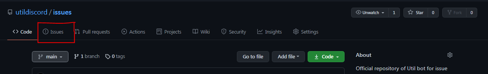
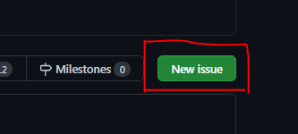

# Util Issues Reports & Features requests
Official repository of Util bot for issue reports and feature requests. This is the place to submit bugs and other issues.

## Guide for creating issues
This is guide showing how you can create an issue for either bug reports, feature requests or other stuff.

First off, Go to the issues tab. 

Now click on "New issue" to create a new issue.

After that, you will be seeing something like this:

When describing the issue, you need to take care of following things:
- For features request, Tell us everything and describe it clearly and briefly.
- For bug reports, Provide a brief summary and also tell the steps to reproduce the bug
- For documentation improvements, Tell us the page and closest anchor (if you know).
- For other issues, Just be descriptive.

