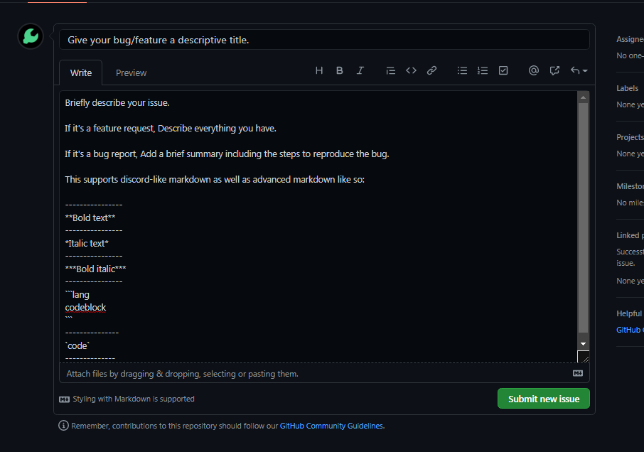

# Util Issues Reports & Features requests
Official repository of Util bot for issue reports and feature requests. This is the place to submit bugs and other issues.

## Guide for creating issues
This is guide showing how you can create an issue for either bug reports, feature requests or other stuff.

### Creating a new issue

First off, Go to the issues tab. 

Now click on "New issue" to create a new issue.

### Describing the issue

After that, you will be seeing something like this:

When describing the issue, you need to take care of following things:
- For features request, Tell us everything and describe it clearly and briefly.
- For bug reports, Provide a brief summary and also tell the steps to reproduce the bug
- For documentation improvements, Tell us the page and closest anchor (if you know).
- For other issues, Just be descriptive.

Tips:
- This supports advanced markdown. (Code blocks, Bold and italic texts. Just like discord's markdown)
- You can also use emojis easily like: `:emoji_name:`

### Selecting Labels

Labels are used to organize issues in category like bugs, feature requests etc. Click on labels dropdown and select related labels.

Now finally submit the issue.

## What now?

Once you have submitted the issue, Visitors and Maintainers can see your issue. We will review your issue. You, visitors and maintainers can use Comments to discuss the issue.

When the issue is sorted out, It is closed.

- For bug reports, It remains open till bug is not fixed.
- For feature requests and improvements, It remains open till the feature or improvement has been added to bot.

## Good luck!
Your contribution to Util is always appreciated! In fact, they are the reason for Util to stay alive. Feel free to open issues. 
> See something, Say something!
